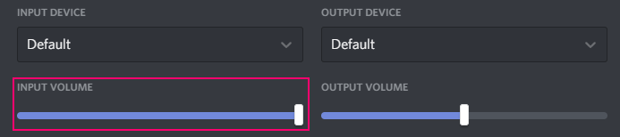
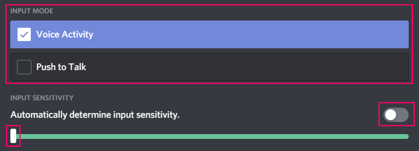
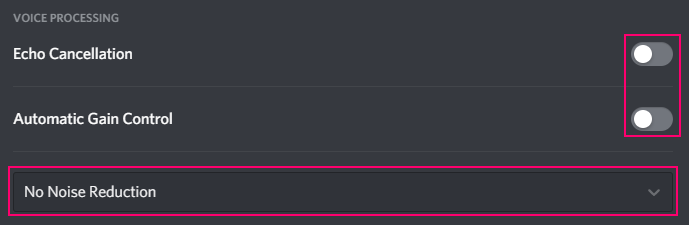
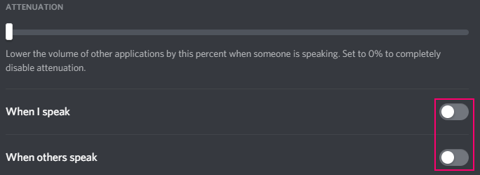
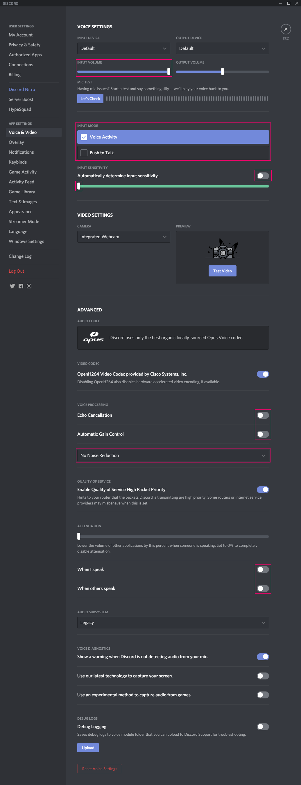

# Optimizing Audio for Musical Performance on Discord

## Downloading Discord

It is highly recommended that you download the Discord desktop app instead of running Discord from your browser. If you do not already have OBS Studio installed, then you should download the installer for your operating system from [the Discord App website](https://discordapp.com/download).

Once you've installed and logged in, navigate to **Settings** > **App Settings** > **Voice and Video**.

## Gain

You'll want to ensure that Discord is receiving audio from your input device at 100%.

## Input Mode / Discord's Built-In Gate

Being that this guide is aimed at those playling instruments, it isn't really practical to be using PTT (push to talk). You'll want to ensure that whenever you are performing that the input mode is set to **Voice Activity**. After changing to this input mode, we also want to disable the option titled **Automatically determine input sensitivity** so that we may adjust the [gate](https://en.wikipedia.org/wiki/Noise_gate) manually. To play it safe, you can drag it all the way to the left and set it to activate when a decibel threshold of -100dB has been reached. However, you can dial it in to another value after ensuring it doesn't close when playing/singing quietly if you prefer.

## Voice Processing

Discord has some built in vocal processing that is tuned for normal speech, but it tends to cause undesirable changes for frequency ranges used by many instruments and when singing. For most setups, it is best to disable **Echo Cancellation** and **Automatic Gain Control**. In addition, you should make sure noise suppression is set to **No Noise Reduction**.

## Attenuation

These settings will affect those virtually routing their audio through a [DAW](https://en.wikipedia.org/wiki/Digital_audio_workstation) and some other pieces of software. Disable both **When I speak** and **When others speak** unless you have a particular need for them.

## The Entire Setup

Assuming you've followed the above, your settings should look something like this.

